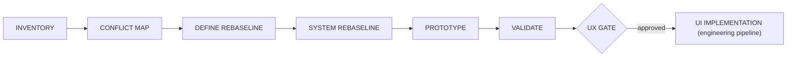

# Experience Foundation — Design Process

> Status: reset 2026-08-17 for V1 mobile parity; UX gate closed.
> Owner: human product owner.
> Companion to ADR-0019 (supersedes ADR-0017) and ADR-0020.

---

## Overview

The V1 mobile implementation is the canonical design input. The Experience
Foundation now verifies parity and documents V2 adaptations instead of
inventing a greenfield mobile experience. Backend work may proceed
independently. The UX gate blocks **product screens in `apps/mobile`**, not
backend specs or implementation.



---

## Active stages

### 1. INVENTORY

Map every V1 mobile route, component, token, transition, visible state, and
data dependency. Capture golden screenshots and interaction recordings for
P1 journeys. The V1 repository is read-only.

**Approval:** owner confirms the inventory represents the canonical app.

### 2. CONFLICT MAP

Classify each behavior as preserve, adapt, review, or drop. Map every
interactive behavior to a V2 action/event/local-state boundary and identify
ADR/spec blockers.

**Approval:** owner confirms product dispositions; architecture conflicts
enter ADR or spec rework before implementation.

### 3. DEFINE REBASELINE

Rework IA and journeys from the V1 route model. Preserve customer/staff tabs,
stacks, sheets, gestures, and entry paths. Add only approved V2 adaptations:
public/auth handoff, verified contexts, account deletion, and a contextual AI
overlay.

**Approval:** replaces the previous DEFINE Approval #2.

### 4. SYSTEM REBASELINE

Re-derive tokens and component contracts from the V1 implementation. Carry V1
colors first; a later palette change is separate. Bind accessibility,
offline, localization, and AI-context requirements to concrete components.

**Approval:** replaces the previous SYSTEM Approval #3.

### 5. PROTOTYPE

Prototype P1 parity flows from golden references, including exceptional V2
adaptations and one classic↔AI handoff.

### 6. VALIDATE

The owner and one owner-designated reference user evaluate internally against
parity evidence. Results remain labeled `internal evaluation only`.

The detailed RESEARCH/DEFINE/SYSTEM requirements below remain useful where
they do not conflict with ADR-0019. Existing research is retained as evidence,
not as authority over the canonical V1 experience.

---

## Retained stage requirements

### 1. RESEARCH

**Goal:** Establish an evidence-backed view of Ukrainian market patterns and
competitor UX while keeping internal assumptions explicit.

**Outputs:**
- Research brief (goals, methods, timeline).
- Ukrainian-market and competitor audit (Instagram, Telegram, Monobank,
  Nova Poshta, Poster, Checkbox, Horoshop — interaction patterns that users
  are already trained on).
- Assumption register separating product constraints, documented V1 behavior,
  competitor evidence, owner assumptions, and reference-user observations.
- Summary of patterns to adopt, adapt, or deliberately avoid, including
  evidence limitations and open questions.

**Approval:** Human owner reviews and approves the research summary before
DEFINE begins.

---

### 2. DEFINE

**Goal:** Translate research into structural decisions.

**Outputs:**
- Information architecture (screen hierarchy, navigation model for staff
  panel, consumer discovery surface, and customer cabinet within a single
  app binary).
- Multi-flow journey maps:
  - Classic UI path for each core journey (discovery, order, catalog, chat,
    documents).
  - AI chat path for the same journeys.
  - Handoff points between classic and AI flows.
  - Three entry-path variants: **search/browse discovery** (ADR-0018),
    **invite**, and **direct link** — with fallback states (no results,
    unpublished company, deactivated product, loading, offline, error).
- Content principles (tone, language, terminology for Ukrainian audience).
- Accessibility baseline (WCAG 2.1 AA minimum; touch targets, contrast,
  screen reader considerations for mobile).

**Approval:** Human owner reviews IA, journeys, and principles.

---

### 3. SYSTEM

**Goal:** Build the reusable design language.

**Outputs:**
- Design tokens (color palette, typography scale, spacing, elevation,
  motion/easing, border radii) — mapped to Unistyles theme structure.
- Core component contracts (button, input, card, list item, bottom sheet,
  modal, toast, avatar, badge, skeleton, empty state, error state) — props,
  variants, states, accessibility requirements.
- Iconography and illustration direction.
- Layout system (responsive grid, safe areas, keyboard-aware scroll).
- Dark mode strategy (if applicable for V2 launch or deferred).

**Approval:** Human owner reviews token spec and component contracts.

---

### 4. PROTOTYPE

**Goal:** Assemble the system into representative interactive screens.

**Outputs:**
- Interactive prototypes (Figma or equivalent) covering at minimum:
  - Onboarding / sign-in.
  - Consumer: search → results → company profile → cart (discovery entry).
  - Consumer: invite link → install → sign in → company context (invite entry).
  - Consumer: direct link → company profile (direct-link entry).
  - Staff: catalog management, order list, order detail in chat.
  - Customer: company profile, cart, checkout, redirect to chat.
  - AI chat: a representative action (e.g., "create an order for customer X").
  - AI chat: discovery-equivalent (e.g., "find me a confectionery in Kyiv").
- Loading, empty, error, offline, no-results, and unpublished/deactivated
  state examples for discovery and company screens.
- Multi-flow transition examples (AI suggests → user confirms in classic UI;
  consumer discovers → enters company → becomes customer).

**Approval:** Human owner reviews prototypes before validation.

---

### 5. VALIDATE

**Goal:** Evaluate prototypes internally against the approved journeys and
record usability limitations honestly.

**Outputs:**
- Internal evaluation plan for the human owner and one owner-designated
  reference user; tasks are derived from core journeys.
- Test results and findings.
- Iteration log (what changed based on feedback).
- Final internally evaluated prototypes.

**Approval:** Human owner confirms internal evaluation is sufficient and
accepts the absence of representative external validation.

---

## UX Gate

The UX gate is a formal checkpoint. Product screens in `apps/mobile`
(engineering `/implement` for UI) are blocked until:

1. ADR-0019 and ADR-0020 are accepted.
2. V1 mobile screen, component, token, and state inventories are approved.
3. Every conflict has an owner disposition.
4. Every interactive behavior maps to a V2 action/event or approved rework.
5. V1-derived IA and journeys receive replacement DEFINE approval.
6. V1-derived tokens/components receive replacement SYSTEM approval.
7. P1 parity prototypes include all canonical contexts and one AI handoff.
8. Owner/reference-user evaluation is labeled `internal evaluation only`.
9. Human owner explicitly records the gate as open.

**Exception:** Expo app shell infrastructure (navigation skeleton, auth
screens, deep-link routing) is NOT gated — it is technical foundation
work that enables later product screens but does not itself constitute a
product UX decision.

---

## Multi-flow design requirements

Every design artifact must address all three dimensions:

| Dimension | Values |
| --- | --- |
| Interaction mode | Classic UI (screens, forms, lists) · AI chat (text, tool calls, generative UI cards) |
| Persona | Staff / company owner · Consumer (discovery) · Customer (company-scoped) |
| Entry path | Search/browse discovery · Invite · Direct link |

A component or journey is not complete until it specifies behavior in all
applicable intersections (not every component appears in every cell).

---

## Integration with the engineering pipeline

- `docs/pipeline.md` remains the engineering SDD conveyor.
- The only addition to the engineering pipeline: product-screen
  implementation requires a reference to the approved inventory / mapping
  artifact and is rejected if the UX gate has not been passed. Backend
  `/spec` and `/plan` are not gated.
- UI implementation tasks (`/implement`) reference the module spec and the
  V1 inventory, not archived greenfield component contracts.
- UI acceptance criteria (added to the definition of done for UI tasks):
  journey conformance, classic/AI parity where applicable, accessibility
  baseline, loading/empty/error/offline states, localization readiness, and
  internal evaluation evidence with its limitation.

---

## Artifact location

All design documentation lives in `docs/design/`:

```
docs/design/
├── process.md              ← this file
├── inventory/
│   ├── v1-mobile-screen-map.md
│   ├── v1-mobile-component-inventory.md
│   └── v1-mobile-token-baseline.md
├── mapping/
│   ├── v1-to-v2-conflict-register.md
│   └── v1-ux-to-v2-capability-matrix.md
├── research/
│   ├── brief.md
│   └── competitor-audit.md
├── define/
│   ├── journeys/README.md  (greenfield journeys archived)
│   ├── content-principles.md
│   └── accessibility-baseline.md
├── system/
│   └── README.md           (greenfield system archived; use inventory/)
├── prototypes/
│   └── README.md           (links to Figma or equivalent)
└── validation/
    ├── test-plan.md
    └── results.md
```

Files are created as the workstream progresses; this skeleton documents
the expected structure only.
