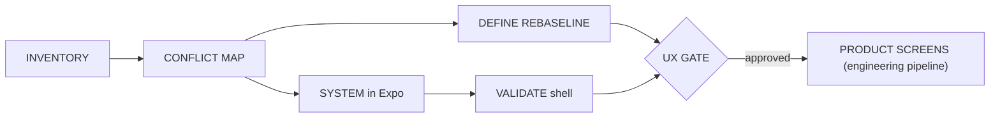

# Experience Foundation — Design Process

> Status: reset 2026-08-17 for V1 mobile parity; UX gate closed.
> Amended 2026-08-19: SYSTEM/prototypes are running Expo, not Figma;
> AI overlay is not a gate dependency. Port rule:
> [`mapping/v1-mobile-port-recipe.md`](mapping/v1-mobile-port-recipe.md).
> Owner: human product owner.
> Companion to ADR-0019 (supersedes ADR-0017) and ADR-0020.

---

## Overview

The V1 mobile implementation is the canonical design input. The Experience
Foundation now verifies parity and documents V2 adaptations instead of
inventing a greenfield mobile experience. Backend work may proceed
independently. The UX gate blocks **product screens in `apps/mobile`**, not
backend specs or implementation.



---

## Active stages

### 1. INVENTORY

Map every V1 mobile route, component, token, transition, visible state, and
data dependency. Capture golden screenshots and interaction recordings for
P1 journeys. The V1 repository is read-only.

**Approval:** owner confirms the inventory represents the canonical app.

### 2. CONFLICT MAP

Classify each behavior as preserve, adapt, review, or drop. Map every
interactive behavior to a V2 action/event/local-state boundary and identify
ADR/spec blockers.

**Approval:** owner confirms product dispositions; architecture conflicts
enter ADR or spec rework before implementation.

### 3. DEFINE REBASELINE

Rework IA and journeys from the V1 route model. Preserve customer/staff tabs,
stacks, sheets, gestures, and entry paths. Add only approved V2 adaptations:
public/auth handoff, verified contexts, and account deletion. A contextual
AI overlay is approved in direction (ADR-0019) and scheduled as `vm-T29`;
it is not a DEFINE or gate deliverable.

**Approval:** replaces the previous DEFINE Approval #2.

### 4. SYSTEM REBASELINE

Re-derive tokens and component contracts from the V1 implementation, in
**code**. Carry V1 colors first; a later palette change is separate. The
Unistyles theme lands in fnd-T48; primitives and shell are `vm-T14`…`T16`.
Figma is not the SYSTEM artifact. Bind accessibility, offline, localization,
and (later) AI-context requirements to concrete components.

**Approval:** owner reviews the running theme and primitives on a device or
simulator. This replaces the previous SYSTEM Approval #3.

### 5. PROTOTYPE

There is no Figma prototype wave. Auth and the app shell run as Expo
foundation (fnd-T49/T50). Product-flow parity is proven on the vertical
slices after the gate (`vm-T18`…), compared to V1 screenshots and recordings.
The contextual AI overlay is `vm-T29` and is **not** required to open the
gate.

### 6. VALIDATE

The owner (and, when designated, one reference user) evaluates the running
Expo SYSTEM — theme, primitives, auth shell — internally. Full P1 journey
evaluation happens on vertical slices and in `vm-T30`. Results remain
labeled `internal evaluation only`.

The detailed RESEARCH/DEFINE/SYSTEM requirements below remain useful where
they do not conflict with ADR-0019. Existing research is retained as evidence,
not as authority over the canonical V1 experience.

---

## Retained stage requirements

### 1. RESEARCH

**Goal:** Establish an evidence-backed view of Ukrainian market patterns and
competitor UX while keeping internal assumptions explicit.

**Outputs:**
- Research brief (goals, methods, timeline).
- Ukrainian-market and competitor audit (Instagram, Telegram, Monobank,
  Nova Poshta, Poster, Checkbox, Horoshop — interaction patterns that users
  are already trained on).
- Assumption register separating product constraints, documented V1 behavior,
  competitor evidence, owner assumptions, and reference-user observations.
- Summary of patterns to adopt, adapt, or deliberately avoid, including
  evidence limitations and open questions.

**Approval:** Human owner reviews and approves the research summary before
DEFINE begins.

---

### 2. DEFINE

**Goal:** Translate research into structural decisions.

**Outputs:**
- Information architecture (screen hierarchy, navigation model for staff
  panel, consumer discovery surface, and customer cabinet within a single
  app binary).
- Multi-flow journey maps:
  - Classic UI path for each core journey (discovery, order, catalog, chat,
    documents).
  - AI overlay path is directed (ADR-0019) and specified with the `vm-T29`
    slice; it is not a DEFINE gate deliverable.
  - Three entry-path variants: **search/browse discovery** (ADR-0018),
    **invite**, and **direct link** — with fallback states (no results,
    unpublished company, deactivated product, loading, offline, error).
- Content principles (tone, language, terminology for Ukrainian audience).
- Accessibility baseline (WCAG 2.1 AA minimum; touch targets, contrast,
  screen reader considerations for mobile).

**Approval:** Human owner reviews IA, journeys, and principles.

---

### 3. SYSTEM

**Goal:** Build the reusable design language.

**Outputs:**
- Design tokens (color palette, typography scale, spacing, elevation,
  motion/easing, border radii) implemented as the Unistyles theme in
  `apps/mobile` from the V1 inventory — not a parallel Figma library.
- Core component contracts implemented as primitives (`vm-T14`…`T16`):
  button, input, card, list item, bottom sheet, toast, avatar, badge,
  skeleton, empty/error — props, variants, states, accessibility.
- Iconography carried from V1 (Lucide usage and sizes), not a new set.
- Layout system (safe areas, keyboard-aware scroll) in the screen shell.
- Light, dark, and system modes from the V1 theme contract.

**Approval:** Human owner reviews the running theme and primitives.

---

### 4. PROTOTYPE

**Goal:** Prove parity on running software, not a Figma file.

**Outputs:**
- fnd-T48 theme + `vm-T14`…`T16` primitives and shell in `apps/mobile`.
- fnd-T49/T50 auth and deep-link infrastructure (ADR-0019 exception).
- After the gate, each vertical slice compared to V1 screenshots/recordings,
  including loading/empty/error/offline for that slice.
- Contextual AI overlay (`vm-T29`) after classic slices, not before the gate.

**Approval:** Human owner reviews the running SYSTEM before the gate;
journey-level review is per slice and `vm-T30`.

---

### 5. VALIDATE

**Goal:** Evaluate the running Expo SYSTEM internally and record limitations
honestly. Full P1 journey evaluation is not a gate input.

**Outputs:**
- Owner (and optional reference-user) notes on theme, primitives, and auth
  shell, labeled `internal evaluation only`.
- Port findings dispositions for any Class C items the review raises.
- Slice-level evaluation records under `docs/design/validation/` as product
  screens land.

**Approval:** Human owner confirms SYSTEM evaluation is enough to open the
gate and accepts the absence of representative external validation.

---

## UX Gate

The UX gate is a formal checkpoint. Product screens in `apps/mobile`
(engineering `/implement` for UI) are blocked until:

1. ADR-0019 and ADR-0020 are accepted.
2. V1 mobile screen, component, token, and state inventories are approved.
3. Every conflict has an owner disposition.
4. Every interactive behavior maps to a V2 action/event or approved rework.
5. V1-derived IA (tabs, stacks, sheets, entry paths) receives replacement
   DEFINE approval. Contextual AI overlay is directed, not delivered.
6. V1-derived Unistyles theme (fnd-T48) and primitives/shell (`vm-T14`…`T16`)
   receive replacement SYSTEM approval on a running device/simulator.
7. Owner evaluation of that running SYSTEM is labeled
   `internal evaluation only`. Full P1 journey prototypes and the AI overlay
   are not gate inputs.
8. Human owner explicitly records the gate as open.

**Exception:** Expo app shell infrastructure (navigation skeleton, auth
screens, deep-link routing) is NOT gated — it is technical foundation
work that enables later product screens but does not itself constitute a
product UX decision.

---

## Multi-flow design requirements

Launch completeness still spans three dimensions:

| Dimension | Values |
| --- | --- |
| Interaction mode | Classic UI (screens, forms, lists) · AI overlay (`vm-T29`) |
| Persona | Staff / company owner · Consumer (discovery) · Customer (company-scoped) |
| Entry path | Search/browse discovery · Invite · Direct link |

A **product journey** is not complete until classic UI is specified for every
applicable persona and entry path. The AI overlay is a later slice that must
call the same actions; it is not required on theme/primitive PRs or to open
the UX gate.

---

## Integration with the engineering pipeline

- `docs/pipeline.md` is the engineering feature loop (ADR-0023).
- The only addition to the engineering pipeline: product-screen
  implementation requires a reference to the approved inventory / mapping
  artifact and is rejected if the UX gate has not been passed. Backend
  `/feature` tickets are not gated.
- UI implementation tasks (`/implement`) reference the feature card, the
  V1 inventory, and `docs/design/mapping/v1-mobile-port-recipe.md`, not
  archived greenfield component contracts, archived domain specs, or Figma.
- UI acceptance criteria (added to the definition of done for UI tasks):
  journey conformance, accessibility baseline, loading/empty/error/offline
  states, localization readiness, port-recipe Class A/B hygiene, and
  internal evaluation evidence with its limitation. Classic/AI parity is
  required when `vm-T29` is in scope, not on every earlier UI PR.

---

## Artifact location

All design documentation lives in `docs/design/`:

```
docs/design/
├── process.md              ← this file
├── inventory/
│   ├── v1-mobile-screen-map.md
│   ├── v1-mobile-component-inventory.md
│   └── v1-mobile-token-baseline.md
├── mapping/
│   ├── v1-to-v2-conflict-register.md
│   ├── v1-ux-to-v2-capability-matrix.md
│   ├── v1-mobile-port-recipe.md
│   └── v1-port-findings.md
├── research/
│   ├── brief.md
│   └── competitor-audit.md
├── define/
│   ├── journeys/README.md  (greenfield journeys archived)
│   ├── content-principles.md
│   └── accessibility-baseline.md
├── system/
│   └── README.md           (greenfield system archived; use inventory/)
├── prototypes/
│   └── README.md           (not a Figma gate; optional later)
└── validation/
    ├── test-plan.md
    └── results.md
```

Files are created as the workstream progresses; this skeleton documents
the expected structure only.
