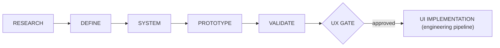

# Experience Foundation — Design Process

> Status: skeleton (approved structure, execution not started).
> Owner: human product owner.
> Companion to ADR-0017.

---

## Overview

The Experience Foundation runs as a parallel workstream alongside the
technical foundation (phases 0–1). Its output — validated design artifacts —
gates all product UI implementation. Backend work may proceed independently;
only UI specs and UI implementation are blocked by the UX gate.



---

## Stages

### 1. RESEARCH

**Goal:** Understand Ukrainian users, market patterns, and competitor UX.

**Outputs:**
- Research brief (goals, methods, timeline).
- Ukrainian-market and competitor audit (Instagram, Telegram, Monobank,
  Nova Poshta, Poster, Checkbox, Horoshop — interaction patterns that users
  are already trained on).
- Personas and jobs-to-be-done for both dimensions:
  - Staff/owner vs. customer.
  - Classic UI vs. AI chat.
- Summary of patterns to adopt, adapt, or deliberately avoid.

**Approval:** Human owner reviews and approves the research summary before
DEFINE begins.

---

### 2. DEFINE

**Goal:** Translate research into structural decisions.

**Outputs:**
- Information architecture (screen hierarchy, navigation model for both
  staff panel and customer cabinet within a single app binary).
- Dual-flow journey maps:
  - Classic UI path for each core journey (order, catalog, chat, documents).
  - AI chat path for the same journeys.
  - Handoff points between classic and AI flows.
- Content principles (tone, language, terminology for Ukrainian audience).
- Accessibility baseline (WCAG 2.1 AA minimum; touch targets, contrast,
  screen reader considerations for mobile).

**Approval:** Human owner reviews IA, journeys, and principles.

---

### 3. SYSTEM

**Goal:** Build the reusable design language.

**Outputs:**
- Design tokens (color palette, typography scale, spacing, elevation,
  motion/easing, border radii) — mapped to Unistyles theme structure.
- Core component contracts (button, input, card, list item, bottom sheet,
  modal, toast, avatar, badge, skeleton, empty state, error state) — props,
  variants, states, accessibility requirements.
- Iconography and illustration direction.
- Layout system (responsive grid, safe areas, keyboard-aware scroll).
- Dark mode strategy (if applicable for V2 launch or deferred).

**Approval:** Human owner reviews token spec and component contracts.

---

### 4. PROTOTYPE

**Goal:** Assemble the system into representative interactive screens.

**Outputs:**
- Interactive prototypes (Figma or equivalent) covering at minimum:
  - Onboarding / sign-in.
  - Staff: catalog management, order list, order detail in chat.
  - Customer: company profile, cart, checkout, redirect to chat.
  - AI chat: a representative action (e.g., "create an order for customer X").
- Loading, empty, error, and offline state examples.
- Dual-flow transition examples (AI suggests → user confirms in classic UI).

**Approval:** Human owner reviews prototypes before validation.

---

### 5. VALIDATE

**Goal:** Test prototypes with real target users.

**Outputs:**
- Usability test plan (participants: Ukrainian small business owners and
  their customers; tasks derived from core journeys).
- Test results and findings.
- Iteration log (what changed based on feedback).
- Final validated prototypes.

**Approval:** Human owner confirms validation is sufficient.

---

## UX Gate

The UX gate is a formal checkpoint. Product UI implementation (engineering
pipeline `/spec`, `/plan`, `/implement` for screens) is blocked until:

1. Research summary is approved.
2. IA and journey maps are approved.
3. Token spec and component contracts are approved.
4. Representative prototypes are validated with users.
5. Human owner explicitly opens the gate.

**Exception:** Expo app shell infrastructure (navigation skeleton, auth
screens, deep-link routing) is NOT gated — it is technical foundation
work that enables later product screens but does not itself constitute a
product UX decision.

---

## Dual-flow design requirements

Every design artifact must address both dimensions:

| Dimension | Side A | Side B |
| --- | --- | --- |
| Interaction mode | Classic UI (screens, forms, lists) | AI chat (text, tool calls, generative UI cards) |
| Persona | Staff / company owner | Customer |

A component or journey is not complete until it specifies behavior in all
four quadrants where applicable (not all components appear in all quadrants).

---

## Integration with the engineering pipeline

- `docs/pipeline.md` remains the engineering SDD conveyor.
- The only addition to the engineering pipeline: UI specs (`/spec`) and UI
  plans (`/plan`) for product screens require a reference to the approved
  design artifact and are rejected if the UX gate has not been passed.
- UI implementation tasks (`/implement`) reference both the module spec and
  the design-system component contracts.
- UI acceptance criteria (added to the definition of done for UI tasks):
  journey conformance, classic/AI parity where applicable, accessibility
  baseline, loading/empty/error/offline states, localization readiness, and
  usability evidence.

---

## Artifact location

All design documentation lives in `docs/design/`:

```
docs/design/
├── process.md              ← this file
├── research/
│   ├── brief.md
│   ├── competitor-audit.md
│   └── personas.md
├── define/
│   ├── information-architecture.md
│   ├── journeys/
│   │   ├── order-classic.md
│   │   ├── order-ai.md
│   │   └── ...
│   ├── content-principles.md
│   └── accessibility-baseline.md
├── system/
│   ├── tokens.md
│   ├── components/
│   │   ├── button.md
│   │   ├── input.md
│   │   └── ...
│   ├── iconography.md
│   └── layout.md
├── prototypes/
│   └── README.md           (links to Figma or equivalent)
└── validation/
    ├── test-plan.md
    └── results.md
```

Files are created as the workstream progresses; this skeleton documents
the expected structure only.
