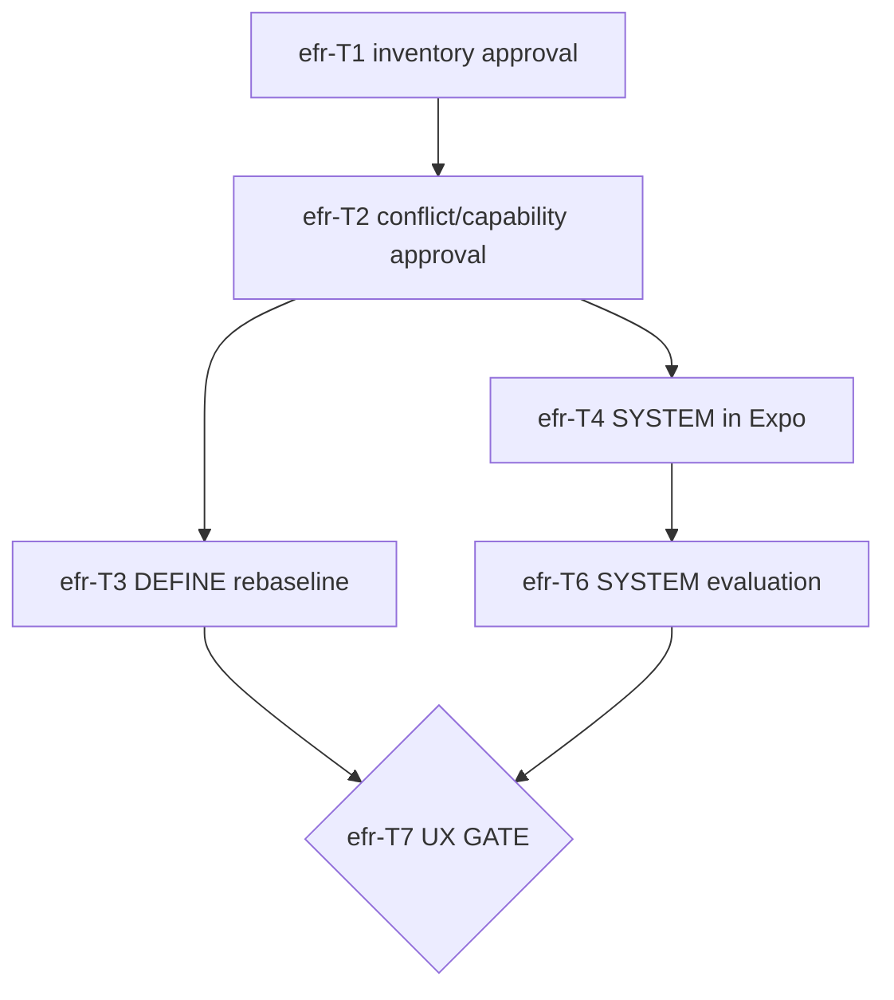
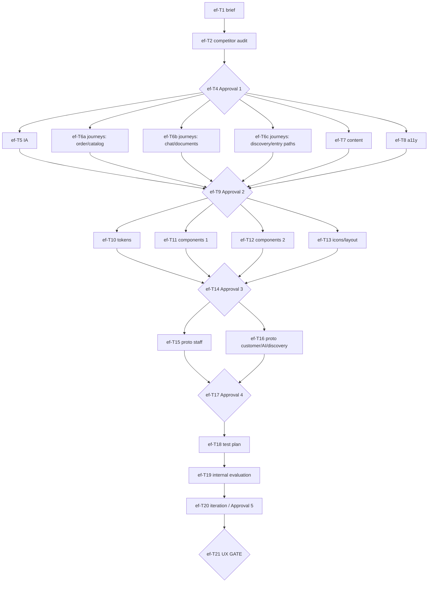

# Experience Foundation — Plan

> Status: **reset 2026-08-20** — Magic Patterns is the V2 UX canon
> ([ADR-0023](../adr/0023-magic-patterns-canonical-ux.md)). The V1 parity
> rebaseline below is historical; do not execute efr-T* as written.
> Operating rule: [`docs/design/mapping/mp-to-mobile.md`](../design/mapping/mp-to-mobile.md).
> Process: [`docs/design/process.md`](../design/process.md).
>
> Previous status (2026-08-17, ADR-0019) kept below for ticket archaeology
> (SHO-5 … SHO-27). Close or re-scope those issues before reuse.

> Amended **2026-08-19**: SYSTEM is running Expo (theme + primitives), not
> Figma; efr-T5 full-journey/Figma prototypes are cancelled; AI overlay is
> not a gate dependency.
> The original ef-T1…T21 graph below is historical and must be re-cut.
> Greenfield DEFINE journeys/IA and SYSTEM docs were moved to
> `docs/archive/design/` on 2026-08-18 and are not authority.
>
> Sources: [ADR-0019](../adr/0019-v1-mobile-canonical-ux.md) (superseded),
> [ADR-0020](../adr/0020-public-discovery-and-social-engagement.md),
> [`docs/design/process.md`](../design/process.md).

This is the task breakdown for the Experience Foundation workstream — the
parallel design track that runs alongside technical phases 0–1 and gates all
product UI implementation (pipeline rule 5, ADR-0019). It is not a code
module, so this plan deviates from the standard `/plan` format:

- **Deliverables are design artifacts** in `docs/design/` and the running
  Unistyles theme/primitives in `apps/mobile`, not Figma. "One task = one PR
  ≤ ~300 diff lines" becomes "one task = one reviewable artifact set"; a PR
  is still opened per task.
- **TDD test lists are replaced by acceptance criteria** — the stage outputs
  defined in `process.md`. Classic staff/customer surfaces are in scope for
  SYSTEM. The AI overlay is `vm-T29`, not a per-artifact gate rule.
- **Approval checkpoints replace CI gates.** Each stage ends with an
  explicit human-owner approval task; the next stage's tasks stay blocked
  until it passes.
- **Execution mode is marked per task**: `agent` (agent drafts, human
  reviews), `human-led` (requires real-world activity the agent cannot do,
  e.g. internal evaluation of the running Expo SYSTEM), or `human` (owner decision).

Linear mapping: one issue per task in team **Showzy-v2**, project
**Experience Foundation** (pipeline.md "Linear workflow"), label `design`
(created for this workstream — owner-approved). Milestones = the five
stages plus a UX Gate milestone. Stage-approval tasks are assigned to the
human owner. Tickets created 2026-08-17: **SHO-5 … SHO-27**; SHO-7 is
cancelled and SHO-27 is the added ef-T6c discovery journey task.

---

## Current V1 parity rebaseline

Existing Linear issues must be closed, retained as evidence, or re-scoped
before execution. Do not silently reuse a ticket whose acceptance criteria
describe the superseded greenfield design.

### efr-T1: Canonical inventory approval — `human`

- **Scope:** review `docs/design/inventory/`.
- **Acceptance:** routes, components, tokens, motion, and required screen
  states represent the V1 mobile implementation; missing P1 evidence is
  listed.
- **Dependencies:** ADR-0019.

### efr-T2: Conflict and capability approval — `human`

- **Scope:** review `docs/design/mapping/`.
- **Acceptance:** every product conflict has an owner disposition; every
  behavior has an action/event/spec destination or explicit blocker.
- **Dependencies:** efr-T1, ADR-0020.

### efr-T3: DEFINE rebaseline — `agent`, then `human`

- **Scope:** rework information architecture around V1 customer and staff
  tabs, sheets, transitions, public/auth resume, active-company context,
  social collections, and grouped inbox. Document the AI overlay as a
  directed later surface (`vm-T29`), not as a tab and not as a gate
  deliverable.
- **Acceptance:** classic flows trace to inventory references; each approved
  V2 adaptation is explicit; owner grants replacement DEFINE approval.
- **Dependencies:** efr-T2 and disposition of principal/spec blockers.

### efr-T4: SYSTEM rebaseline — `agent`, then `human`

- **Scope:** V1 tokens in the Unistyles theme (fnd-T48) plus primitives and
  shell (`vm-T14`…`T16`) in `apps/mobile`. Follow
  `docs/design/mapping/v1-mobile-port-recipe.md`. No Figma library.
- **Acceptance:** V1 palette is carried first; every P1 primitive traces to
  inventory; owner reviews the running app on a device/simulator.
- **Dependencies:** efr-T2 and fnd-T48. Parallel-eligible with efr-T3.

### efr-T5: Full-journey / Figma prototypes — cancelled

- **Scope:** cancelled 2026-08-19. Product-flow parity is the vertical
  slices after the gate. Do not rebuild this as a Figma wave.
- **Dependencies:** none.

### efr-T6: Internal evaluation of SYSTEM — `human-led`

- **Scope:** owner (and optional reference user) reviews the running theme,
  primitives, and auth shell. Record notes under `docs/design/validation/`.
  Dispose any new Class C rows in `docs/design/mapping/v1-port-findings.md`.
- **Acceptance:** high-severity SYSTEM findings are fixed or accepted;
  evidence is labeled `internal evaluation only`. Full P1 journeys wait for
  slice work and `vm-T30`.
- **Dependencies:** efr-T4.

### efr-T7: UX gate opening — `human`

- **Scope:** execute `docs/design/process.md` UX Gate checklist and record the
  decision in `docs/design/README.md`.
- **Acceptance:** gate explicitly open; product screens in `apps/mobile` may
  start. AI overlay remains `vm-T29`.
- **Dependencies:** efr-T3, efr-T6, and blocking ADR/spec decisions.

---

## Historical greenfield plan (superseded by ADR-0019)

## Stage 1 — RESEARCH

### ef-T1: Research brief — `agent`

- **Scope:** `docs/design/research/brief.md` — research goals, methods
  (desk research, competitor teardown, and later internal evaluation),
  evidence limitations, timeline, and explicit out-of-scope items.
- **Context pack:** `process.md` §1 RESEARCH; ADR-0017 (context section);
  `docs/scope.md` (V2 launch scope — research must not cover dropped
  features).
- **Dependencies:** none. First task of the workstream.
- **Acceptance:** brief covers both dual-flow dimensions
  (staff/customer × classic/AI); methods and evidence limits are executable
  with available resources; human owner signs off before ef-T2 starts.

### ef-T2: Ukrainian-market and competitor audit — `agent`

- **Scope:** `docs/design/research/competitor-audit.md` — interaction-pattern
  audit of Instagram, Telegram, Monobank, Nova Poshta, Poster, Checkbox,
  Horoshop: navigation models, chat/commerce patterns, onboarding, payments
  UX, notification patterns. Per product: patterns users are trained on and
  their relevance to Showzy surfaces.
- **Context pack:** `process.md` §1; approved brief (ef-T1);
  `docs/scope.md`.
- **Dependencies:** ef-T1.
- **Acceptance:** every listed competitor covered; each pattern tagged
  adopt / adapt / avoid with rationale; findings mapped to the four
  dual-flow quadrants where applicable.

### ef-T3: Cancelled — external interviews and personas

- **Owner decision (2026-08-17):** no external participant recruitment,
  compensation, interviews, or evidence-based personas. The human owner and
  one owner-designated reference user are the only prototype evaluators.
- **Consequence:** SHO-7 is cancelled. Research and UX Gate artifacts must
  state `internal evaluation only` and may not claim representative
  target-user validation.

### ef-T4: Research summary + Approval #1 — `agent` draft, `human` approval

- **Scope:** consolidated summary of patterns to adopt, adapt, or
  deliberately avoid (appended to or referenced from
  `docs/design/research/`), plus the formal review. This is process.md's
  "Approval: human owner reviews and approves the research summary before
  DEFINE begins."
- **Context pack:** ef-T2 output, V1 behavior, approved constraints, and the
  explicit internal-assumption register.
- **Dependencies:** ef-T2. **Blocks all DEFINE tasks.**
- **Acceptance:** human owner approves the research summary; evidence
  limitations and open assumptions are explicit.

---

## Stage 2 — DEFINE (historical greenfield; artifacts archived)

### ef-T5: Information architecture — `agent`

- **Scope:** `docs/archive/design/define/information-architecture.md` — screen
  hierarchy and navigation model for the staff panel, consumer discovery
  surface, and customer cabinet within a single app binary (role-based
  navigation per ADR-0017, ADR-0018), including where the AI chat surface
  lives in each context.
- **Context pack:** `process.md` §2; approved research (ef-T4);
  ADR-0010 (mobile-first client strategy); ADR-0018 (consumer discovery);
  `docs/scope.md`.
- **Dependencies:** ef-T4. **Parallel with ef-T6, ef-T7, ef-T8** (journey
  maps may iterate against IA; expect one reconciliation pass).
- **Acceptance:** all three contexts' (staff, consumer, customer) navigation
  fully specified; discovery → company transition located; AI chat
  entry/exit points located; no screens for dropped/deferred scope.

### ef-T6a: Dual-flow journey maps — order and catalog — `agent`

- **Scope:** `docs/archive/design/define/journeys/` — for the **order** and
  **catalog** journeys: the classic-UI path, the AI-chat path, and the
  handoff points between them (e.g. AI suggests → user confirms in classic
  UI). One file per journey × flow as in the process.md artifact tree.
  Establishes the journey-map template ef-T6b reuses.
- **Context pack:** `process.md` §2 and §"Dual-flow design requirements";
  approved research (ef-T4); draft IA (ef-T5).
- **Dependencies:** ef-T4. **Parallel with ef-T5, ef-T6b, ef-T7, ef-T8.**
- **Acceptance:** both journeys have both paths plus handoffs; each journey
  addresses all applicable quadrants of the dual-flow matrix.

### ef-T6b: Dual-flow journey maps — chat and documents — `agent`

- **Scope:** same shape as ef-T6a for the **chat** and **documents**
  journeys, using ef-T6a's template (soft dependency: may start in
  parallel, aligns format before merge).
- **Context pack:** same as ef-T6a.
- **Dependencies:** ef-T4. **Parallel with ef-T5, ef-T6a, ef-T6c, ef-T7, ef-T8.**
- **Acceptance:** same bar as ef-T6a for chat and documents; chat journey
  respects the projection rule (chat renders order cards from events, never
  owns order state — blueprint §2.1 invariant 5).

### ef-T6c: Multi-flow journey maps — discovery and entry paths — `agent`

- **Scope:** `docs/archive/design/define/journeys/` — for the **consumer discovery**
  journey and the three entry-path variants: (1) search/browse → profile →
  cart, (2) invite → install → sign in → company context, (3) direct link →
  company profile. Classic-UI and AI-chat paths for each variant. Includes
  fallback states: no results, unpublished company, deactivated product,
  loading, offline, error.
- **Context pack:** `process.md` §2 and §"Multi-flow design requirements";
  ADR-0018 (consumer discovery and principal); approved research (ef-T4);
  draft IA (ef-T5).
- **Dependencies:** ef-T4. **Parallel with ef-T5, ef-T6a, ef-T6b, ef-T7, ef-T8.**
- **Acceptance:** all three entry paths have both classic-UI and AI-chat
  flows; fallback states covered; transition from consumer → customer
  context explicitly mapped.

### ef-T7: Content principles — `agent`

- **Scope:** `docs/design/define/content-principles.md` — tone, language,
  and terminology for the Ukrainian audience, covering both classic UI copy
  and AI-chat voice; canonical term glossary (orders, documents, pricing
  levels) consistent with domain specs.
- **Context pack:** `process.md` §2; approved research summary and assumption
  register; terminology used in `docs/specs/*` (read-only — flag mismatches,
  do not edit specs).
- **Dependencies:** ef-T4. **Parallel with ef-T5, ef-T6, ef-T8.**
- **Acceptance:** principles usable as review criteria for future UI copy;
  glossary covers the core journeys' vocabulary.

### ef-T8: Accessibility baseline — `agent`

- **Scope:** `docs/design/define/accessibility-baseline.md` — WCAG 2.1 AA
  minimum: touch targets, contrast, screen-reader considerations for
  mobile, plus AI-chat-specific accessibility (streaming text, generative
  UI cards).
- **Context pack:** `process.md` §2; ADR-0010.
- **Dependencies:** ef-T4. **Parallel with ef-T5, ef-T6, ef-T7.**
- **Acceptance:** baseline is testable (checkable criteria, not
  aspirations); feeds directly into SYSTEM component contracts.

### ef-T9: Approval #2 — IA, journeys, principles — `human`

- **Scope:** human owner reviews IA, journey maps (including discovery entry
  paths), content principles, and accessibility baseline together (they must
  be mutually consistent).
- **Dependencies:** ef-T5, ef-T6a, ef-T6b, ef-T6c, ef-T7, ef-T8. **Blocks
  all SYSTEM tasks.**
- **Acceptance:** human owner approves; any reconciliation edits between IA
  and journeys are resolved before approval.

---

## Stage 3 — SYSTEM (historical greenfield; artifacts archived)

### ef-T10: Design tokens — `agent`

- **Scope:** `docs/archive/design/system/tokens.md` — color palette, typography
  scale, spacing, elevation, motion/easing, border radii — expressed as a
  Unistyles theme structure (names and shape ready to transcribe into code
  later; **no code in this workstream**). Includes the dark-mode decision
  (V2 launch vs. deferred) as an explicit recommendation for the owner.
- **Context pack:** `process.md` §3; ADR-0017 (mobile-first, Expo +
  Unistyles); approved DEFINE artifacts (ef-T9).
- **Dependencies:** ef-T9. **Parallel with ef-T11, ef-T12, ef-T13.**
- **Acceptance:** every token category from process.md covered; token names
  map 1:1 to a Unistyles theme shape; dark-mode recommendation stated.

### ef-T11: Core component contracts, batch 1 (inputs & actions) — `agent`

- **Scope:** `docs/archive/design/system/components/` — contracts for **button,
  input, list item, card, badge, avatar**: props, variants, states
  (including loading/disabled), accessibility requirements, and behavior in
  each applicable dual-flow quadrant.
- **Context pack:** `process.md` §3 and §"Dual-flow design requirements";
  accessibility baseline (ef-T8); tokens draft (ef-T10).
- **Dependencies:** ef-T9. **Parallel with ef-T10, ef-T12, ef-T13.**
- **Acceptance:** each contract specifies props/variants/states/a11y and
  its dual-flow applicability; consistent contract template across files.

### ef-T12: Core component contracts, batch 2 (surfaces & feedback) — `agent`

- **Scope:** contracts for **bottom sheet, modal, toast, skeleton, empty
  state, error state** — same contract template as batch 1, with special
  attention to how feedback components appear inside the AI-chat surface
  (generative UI cards) vs. classic screens.
- **Context pack:** same as ef-T11.
- **Dependencies:** ef-T9. **Parallel with ef-T10, ef-T11, ef-T13.**
- **Acceptance:** same bar as ef-T11; loading/empty/error semantics align
  with the state examples PROTOTYPE must produce.

### ef-T13: Iconography, illustration, and layout system — `agent`

- **Scope:** `docs/archive/design/system/iconography.md` (icon set direction,
  illustration style) and `docs/archive/design/system/layout.md` (responsive grid,
  safe areas, keyboard-aware scroll).
- **Context pack:** `process.md` §3; ADR-0010; tokens draft (ef-T10).
- **Dependencies:** ef-T9. **Parallel with ef-T10, ef-T11, ef-T12.**
- **Acceptance:** layout rules cover the navigation model from the approved
  IA; icon direction is licensable/feasible (no invented custom set without
  owner sign-off).

### ef-T14: Approval #3 — tokens and component contracts — `human`

- **Scope:** human owner reviews the token spec and all component
  contracts (process.md §3 approval).
- **Dependencies:** ef-T10, ef-T11, ef-T12, ef-T13. **Blocks PROTOTYPE.**
- **Acceptance:** human owner approves; dark-mode decision recorded.

---

## Stage 4 — PROTOTYPE

Prototypes live in Figma, driven by agents through the installed Figma MCP
server (owner decision); the repo artifact is
`docs/design/prototypes/README.md` with links and coverage notes. The human
owner reviews directly in Figma.

### ef-T15: Prototypes — onboarding and staff flows — `agent` (Figma MCP)

- **Scope:** interactive prototypes for onboarding / sign-in and the staff
  side: catalog management, order list, order detail in chat. Built
  strictly from the approved tokens and component contracts.
- **Context pack:** `process.md` §4; approved SYSTEM artifacts (ef-T14);
  journey maps (ef-T6a, ef-T6b).
- **Dependencies:** ef-T14. **Parallel with ef-T16.**
- **Acceptance:** screens use only system components/tokens (deviations
  logged as system change requests, not silent one-offs); staff journeys
  from ef-T6a/ef-T6b are traceable in the prototype.

### ef-T16: Prototypes — consumer discovery, customer, and AI-chat flows, states — `agent` (Figma MCP)

- **Scope:** consumer discovery (search → results → company profile → cart);
  invite and direct-link entry variants; customer side (company profile,
  cart, checkout, redirect to chat); AI chat with representative actions
  (e.g. "create an order for customer X", "find me a confectionery");
  multi-flow transition examples (AI suggests → user confirms in classic UI;
  consumer discovers → enters company → becomes customer); loading, empty,
  error, offline, no-results, and unpublished/deactivated state examples.
- **Context pack:** same as ef-T15; plus ef-T6c (discovery journeys).
- **Dependencies:** ef-T14. **Parallel with ef-T15.**
- **Acceptance:** all state types demonstrated; at least one complete
  classic↔AI handoff is interactive end-to-end; discovery entry path is
  prototyped through to the first company-scoped action.

### ef-T17: Approval #4 — prototype review — `human`

- **Scope:** human owner reviews prototypes before validation
  (process.md §4 approval).
- **Dependencies:** ef-T15, ef-T16. **Blocks VALIDATE.**
- **Acceptance:** human owner approves prototypes as ready to test.

---

## Stage 5 — VALIDATE

### ef-T18: Internal evaluation plan — `agent`

- **Scope:** `docs/design/validation/test-plan.md` — task-based evaluation by
  the human owner and one owner-designated reference user, derived from the
  core journeys; success metrics, session script, and evidence-limit notes.
- **Context pack:** `process.md` §5; approved research summary and assumptions;
  journeys (ef-T6a, ef-T6b, ef-T6c); approved prototypes (ef-T17).
- **Dependencies:** ef-T17.
- **Acceptance:** tasks cover staff/customer contexts and both interaction
  modes; plan is executable by both internal reviewers; limitations are
  explicit.

### ef-T19: Run internal evaluation and record findings — `human-led`

- **Scope:** the owner and reference user conduct the tasks per the plan;
  `docs/design/validation/results.md` — findings, severity, and
  recommendations. Agents assist with note synthesis.
- **Context pack:** test plan (ef-T18); prototypes.
- **Dependencies:** ef-T18.
- **Acceptance:** both reviewers complete all applicable tasks; findings are
  traceable to the tested prototype and labeled `internal evaluation only`.

### ef-T20: Iteration and final internally evaluated prototypes — `agent` (Figma MCP)

- **Scope:** apply changes driven by findings; iteration log (what changed
  and why, appended to `results.md` or a dedicated log); final internally evaluated
  prototype links in `docs/design/prototypes/README.md`. If findings
  invalidate SYSTEM or DEFINE artifacts, those documents are amended and
  re-approved (return to the relevant stage approval), not patched
  silently.
- **Context pack:** ef-T19 results; SYSTEM artifacts.
- **Dependencies:** ef-T19.
- **Acceptance:** every high-severity finding addressed or explicitly
  accepted by the owner; human owner confirms internal evaluation is
  sufficient and accepts its limitation (process.md §5 approval =
  Approval #5).

---

## UX Gate

### ef-T21: UX gate review and opening — `human`

- **Scope:** formal checklist per process.md §"UX Gate": (1) research
  summary approved, (2) IA and journey maps approved, (3) token spec and
  component contracts approved, (4) representative prototypes internally
  evaluated by the owner and reference user, (5) the absence of external
  validation is recorded, (6) human owner explicitly opens the gate. Record the gate
  decision in `docs/design/README.md` (status section) so `/spec`, `/plan`,
  and `/implement` for product screens can reference it.
- **Dependencies:** ef-T20.
- **Acceptance:** gate recorded as open; from this point UI specs and UI
  implementation tasks may proceed (pipeline.md rule 5). The Expo app
  shell, navigation skeleton, and auth screens remain ungated throughout
  (ADR-0017 exception) and are **not** part of this plan.

---

## Dependency graph

## Resolved decisions (owner, 2026-08-17)

1. **Prototyping tool** — Figma via the installed Figma MCP server; agents
   build, owner reviews in Figma.
2. **Linear label** — a `design` label is created for this workstream.
3. **Journey-map task size** — pre-split into ef-T6a (order + catalog) and
   ef-T6b (chat + documents).
4. **External research and validation** — removed. SHO-7 is cancelled; the
   owner and one owner-designated reference user perform internal prototype
   evaluation. No artifact may claim representative target-user validation.
