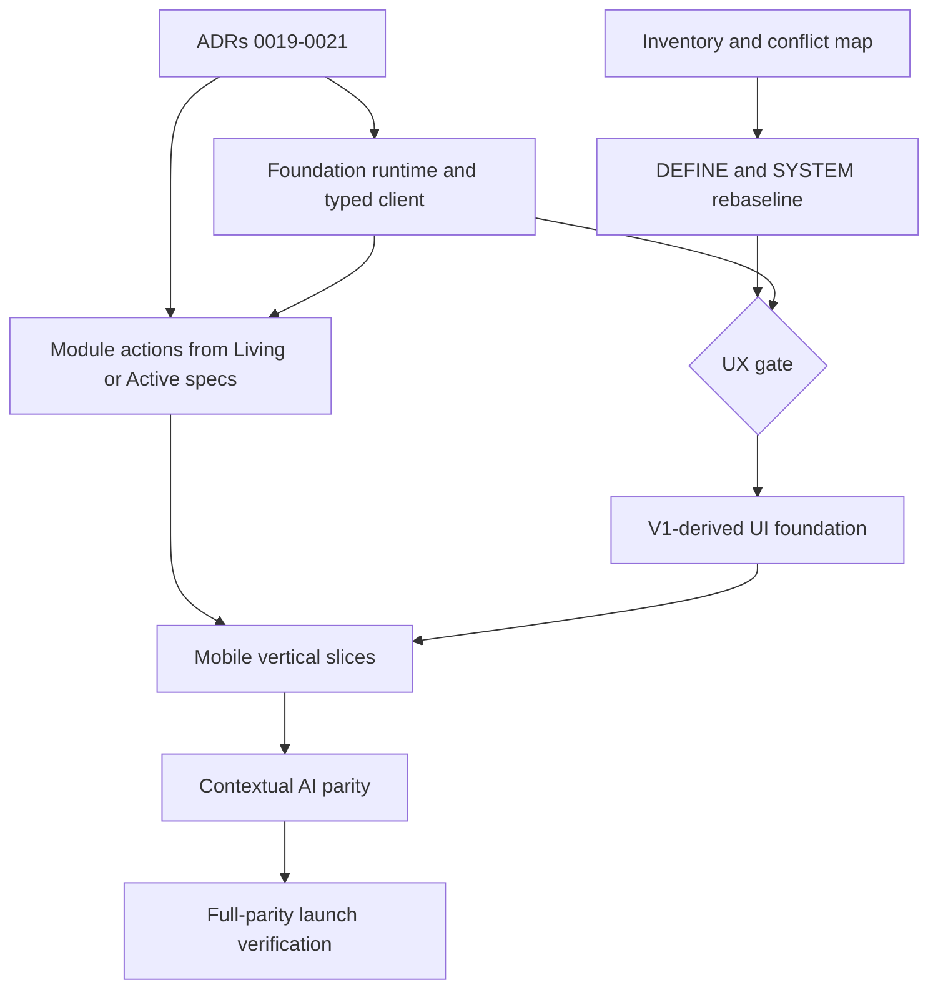

# V1 mobile UX migration roadmap

> Status: owner-approved direction. Spec-rework queues are archived; UX gate
> still blocks product screens only.
> Decisions: ADR-0019 and ADR-0020.
> Product source: `E:\showzy\apps\mobile` (read-only).

## Goal

Ship one mobile application with maximum V1 visual/behavior parity and V2
domain architecture. Mobile never calls a database, legacy Nest endpoint, or
V1 storage API. Classic UI and contextual AI use the same typed actions.

Production launch requires the full owner-approved parity set. Internal
feature flags may expose incomplete vertical slices to internal cohorts.

## Hard gates

1. ADRs 0019–0021, inventory, and conflict mapping are merged (done).
2. Foundation core/contract/auth/API/Expo-client prerequisites exist before
   a module's first implementation.
3. The owning spec is Living or Active and names the actions being built.
   A full freeze and a spec-rework queue are not required.
4. Open the UX gate before product screens in `apps/mobile`.

Backend action work may proceed before the UX gate. Expo shell, auth, and
deep-link infrastructure retain the ADR-0019 exception. The archived
spec-rework queues in `docs/archive/` are not gates.

## Dependency graph

## Workstream A: decisions and specs

### vm-T1: constitutional synchronization

- Reconcile blueprint, scope, module ownership, and roadmap with ADR-0019/0020.
- Confirm clean V2 database and all preserve/adapt/drop decisions.
- **Completed:** no constitutional document contradicts the accepted ADRs.

### vm-T2: stock architecture decision

- Resolve D1 without a cross-module write workaround.
- Prove concurrent confirmation behavior and assign authoritative ownership.
- **Completed:** ADR-0021 keeps stock in catalog and defines declared atomic
  composition.

### vm-T3: foundation contract rework

- Historical. The public-projection pattern is already in the Living/Active
  foundation specs. Further edits follow `docs/specs/README.md`, not a queue.

### vm-T3A: foundation scaffold recut

- Keep merged fnd-T1…T4; do not regenerate migrations or restart scaffold.
- Continue at fnd-T5, with fnd-T5A projection capabilities/fixtures,
  fnd-T19A atomic composition, and stock-atomic reference confirmation.
- **Completed:** `docs/plans/foundation.md` is the executable recut.

### vm-T4…T12: module spec waves

Historical freeze queue — **do not execute as a rework conveyor.** Specs
stay Living until their first implementation. When a slice is about to be
built, tighten that slice; do not freeze the full novels.

Previously listed waves, for orientation only:

1. companies;
2. catalog/files;
3. search/pricing;
4. account/customers/invites/feature flags;
5. orders/payments/delivery;
6. chat/notifications;
7. documents/generation/signing;
8. assistant/UI tools.

Each approved spec is followed by its own module plan and Linear tickets.

## Workstream B: Experience Foundation

Execute `docs/plans/experience-foundation.md` efr-T1…T7:

- approve inventory and mapping;
- research active-company switching;
- rebaseline IA/journeys and system contracts;
- build parity prototypes from golden references;
- run internal evaluation;
- explicitly open the UX gate.

No product screen is implemented from the superseded greenfield IA.

## Workstream C: mobile presentation foundation

Starts only after the UX gate, except technical shell/auth/link work already
allowed by foundation.

### vm-T13: theme and token transcription

- Transcribe the V1 light/dark/system baseline into the approved V2 UI package.
- Keep semantic roles; no color rebrand in this task.
- **Tests:** token shape, mode switching, persistence, contrast audit.

### vm-T14: primitive components — actions and inputs

- Button, icon button, input, OTP/phone input, form field/group, toggle,
  segmented control, quantity controls.
- **Tests:** variants, disabled/loading, keyboard, labels, touch targets.

### vm-T15: primitive components — content and feedback

- Avatar, company avatar, badge, card, menu, skeleton, empty/error states,
  toast.
- **Tests:** theme/localization, accessibility, loading/empty/error.

### vm-T16: shell, glass, sheets, and overlays

- Screen shell, headers, customer/staff tab bars, bottom sheets, picker,
  image viewer, browser, portals.
- **Tests:** safe areas, keyboard, reduced motion, back gestures, presentations.

### vm-T17: client adapters

- Typed oRPC client, auth/session adapter, query-key policy, event invalidation,
  offline states, idempotent retry, upload progress/retry.
- Keep Zustand only for local ephemeral state.
- **Tests:** auth refresh, retry/dedupe, cache invalidation, reconnect.

No V1 package dependency is copied automatically. Every dependency absent from
V2 requires explicit owner approval before it is added.

## Workstream D: vertical mobile slices

Each item is split further if its implementation exceeds about 300 diff lines.
Action tests are written before implementation.

### vm-T18: auth, onboarding, and account

- Phone/email OTP; Google on Android only.
- V1 buyer/seller onboarding, account profile/contact changes, account
  deletion, language/theme.
- **E2E:** sign in, resume requested action, seller creates company, deletion
  confirmation/cancel.

### vm-T19: company context and staff shell

- Multiple memberships/owned companies, one active company, verified staff
  selector, permission-aware tabs, context switcher from approved research.
- **E2E:** switch active company; company A data never appears in B.

### vm-T20: staff catalog, pricing, and clients

- Products/categories/variants/media/stock fields; five-level pricing;
  customers/groups/counterparties/invites.
- **E2E:** create product, assign prices/group, invite customer.

### vm-T21: company presence and public entry

- Published profile/feed, socials, working hours, public/default prices,
  company/product sharing and all deep-link targets.
- **E2E:** public link → profile; auth handoff resumes restricted action.

### vm-T22: discovery and social

- Browse/search/suggest, city/area, relevance/newest/popular;
  follows/likes/comments, counters, Following collections.
- **E2E:** public browse; sign in to follow/like/comment; private collections;
  unpublished targets absent.

### vm-T23: cart, checkout, delivery, and customer orders

- Synced cart, contacts/comment, NP branch/locker/courier, pickup, invoice,
  immutable snapshots, own list/detail/cancel.
- **E2E:** company → cart → checkout → order; duplicate submit; cancel cutoff.

### vm-T24: staff orders and stock confirmation

- Staff list/detail/edit/confirm/cancel, log, fixed states with custom labels.
- Implement D1 stock decision exactly.
- **E2E:** concurrent confirmation, insufficient stock, tenant isolation.

### vm-T25: chat core and grouped inbox

- Customer inbox grouped by company; staff inbox; realtime text,
  pagination/catch-up, reply/edit/delete, reactions, typing/presence/read.
- **E2E:** reconnect dedupe, unread state, cross-conversation denial.

### vm-T26: chat media, cards, and recap

- Images/files, gallery/edit/share, voice, product mentions/carousel,
  order/document cards, domain-composed recap.
- **E2E:** upload retry, card refresh from event, no copied domain state.

### vm-T27: documents and QES

- Mobile document list/create/edit/generate/view/send; PDF; both-party QES;
  artifacts and chat cards.
- **E2E:** order → invoice → sign on device → verify → card update.
- **Security:** known signing vectors; key material never leaves device.

### vm-T28: notifications and integrations

- Device registration and generic preferences/delivery system.
- Initial chat/order/document-signing notifications.
- Nova Poshta active; approved future cards disabled; Meta absent.
- **E2E:** push/deep-link destination and permission changes.

### vm-T29: contextual AI overlay

- Global text overlay, current-screen/entity context, navigate/open/prefill,
  same action descriptors and confirmation flows as classic UI.
- **E2E:** execute each launch action family or complete its required
  human/device handoff; QES remains human-in-the-loop.

## Workstream E: launch verification

### vm-T30: parity and resilience pass

- Compare every P1 route against golden screenshots/recordings.
- Verify Ukrainian/English, light/dark/system, accessibility, reduced motion,
  offline/reconnect, and background uploads.

### vm-T31: full protocol and E2E pass

- Green format, secrets/dependencies, types, lint, unit/integration,
  contract, migration-drift, and Maestro suites.
- Verify cross-tenant, ownership, idempotency, confirmation, events, audit,
  public visibility, and clean-database bootstrap.

### vm-T32: internal rollout

- Enable full app for internal cohorts through feature flags.
- Complete restore/security/release checks and store compliance.
- Public release only after all agreed parity acceptance is green.

## Explicit non-goals

- Web implementation or tested web fallback.
- V1 data migration.
- Meta messaging, embeddings, GPS radius, user discovery, reviews.
- Monobank acquiring at launch.
- Dashboard/analytics placeholders.
- Per-screen redesign or unapproved palette changes.
